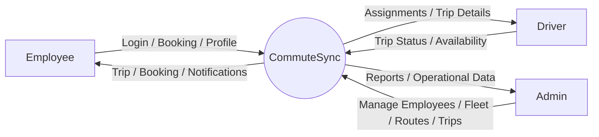
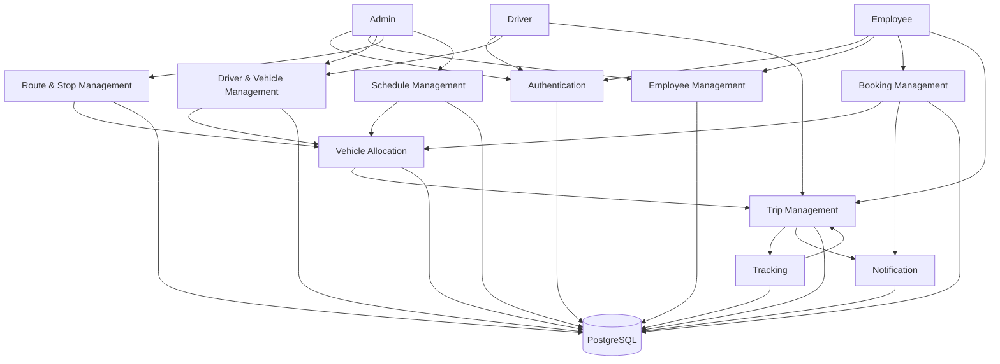

# CommuteSync

CommuteSync is an employee transportation management backend built using Java and Spring Boot.

The idea behind the project is simple. In a company with a large number of employees, managing pickup points, drivers, vehicles, routes, schedules and daily trips manually can become difficult very quickly.

CommuteSync tries to solve that by putting the complete transportation workflow into one backend system.

An employee can view and book a trip, drivers can manage their assigned trips, and admins can manage employees, drivers, vehicles, routes and schedules.

The project also includes a vehicle allocation system which tries to assign available vehicles based on passenger demand and vehicle capacity.

This is a portfolio and learning project inspired by real employee transportation problems. It is not an implementation of any company's internal system.

---

## What the project does

The system is planned around the following workflow:

```text
Admin
  |
  ├── Manage Employees
  ├── Manage Drivers
  ├── Manage Vehicles
  ├── Manage Routes
  └── Manage Schedules
              |
              v
        Transportation System
              |
        Employee Books Trip
              |
              v
       Allocation Engine
              |
              v
       Vehicle Assignment
              |
              v
             Trip
              |
       -----------------
       |       |       |
      Start   Track  Complete
```

---

## Main Features

* User registration and login
* JWT based authentication
* Role based authorization
* Employee management
* Driver management
* Vehicle management
* Route and stop management
* Shift and schedule management
* Trip management
* Employee trip booking
* Vehicle allocation
* Passenger management
* Trip status management
* Notifications
* Audit logging
* Unit testing
* REST API documentation
* Docker based local setup

Some advanced features such as real time tracking, Kafka and microservices will be added later.

---

## Tech Stack

### Backend

* Java
* Spring Boot
* Spring Web
* Spring Data JPA
* Hibernate
* Spring Security
* JWT
* Bean Validation

### Database

* PostgreSQL
* Flyway

### Testing

* JUnit 5
* Mockito
* Spring Boot Test

### Tools

* Maven
* Git
* GitHub
* Postman
* Swagger / OpenAPI
* Docker

### Future technologies

* Redis
* Apache Kafka
* WebSocket
* Microservices
* AWS

---

## Architecture

CommuteSync is being developed as a modular monolith first.

The reason for doing this is to keep the system understandable while still following a structure that can later be split into microservices.

```text
Client
   |
   v
REST API
   |
   v
Controller Layer
   |
   v
Service Layer
   |
   v
Repository Layer
   |
   v
PostgreSQL
```

The application is organized by feature rather than putting all controllers, services and repositories into separate global folders.

---

## Project Structure

```text
commutesync/
│
├── src/
│   ├── main/
│   │   ├── java/com/commutesync/
│   │   │
│   │   └── resources/
│   │       ├── application.properties
│   │       └── db/migration/
│   │
│   └── test/
│
├── docs/
├── postman/
├── docker/
├── docker-compose.yml
├── pom.xml
├── .gitignore
└── README.md
```

---

## Modules

### 1. Project Foundation

This module contains the basic Spring Boot application setup.

It will include database configuration, common configuration, global exception handling and the basic API structure.

The goal here is to make sure the project can start properly before adding business logic.

---

### 2. Authentication and Authorization

This module handles user registration, login and access control.

Users will have different roles:

```text
ADMIN
EMPLOYEE
DRIVER
```

JWT will be used for authentication.

Main concepts:

* Spring Security
* JWT
* Password hashing
* Roles and permissions
* Authentication filters

---

### 3. Employee Management

This module stores employee details and provides employee related APIs.

An employee will be able to manage basic profile information and later view their transportation history.

---

### 4. Driver Management

This module manages drivers.

Driver information includes things such as:

* Name
* Phone
* License information
* Availability
* Status

Drivers will later receive trips through the trip management module.

---

### 5. Vehicle Management

This module manages vehicles available for employee transportation.

Example:

```text
Vehicle Number: PB10AB1234
Capacity: 6
Status: AVAILABLE
```

Vehicle status will be important for the allocation system.

---

### 6. Route and Stop Management

This module defines transportation routes and pickup stops.

Example:

```text
Hostel
   |
   +-- Stop A
   |
   +-- Stop B
   |
   +-- Stop C
   |
   v
Office
```

A route can contain multiple stops.

Later, route distance and estimated travel time can be added.

---

### 7. Shift and Schedule Management

This module defines when transportation is required.

For example:

```text
Morning Shift    09:00 AM
Evening Shift    06:00 PM
Night Shift      10:00 PM
```

Schedules will later be connected with trips.

---

### 8. Trip Management

A trip represents an actual transportation operation.

A trip contains:

* Driver
* Vehicle
* Route
* Date
* Start time
* Status

Trip states:

```text
SCHEDULED
    |
    v
ASSIGNED
    |
    v
STARTED
    |
    v
IN_PROGRESS
    |
    v
COMPLETED
```

Trips can also be cancelled when required.

---

### 9. Booking Management

Employees can book available trips.

The booking module checks things such as:

* Is the trip available?
* Is there a seat?
* Has the employee already booked?
* Is the booking still open?

This module will also handle cancellation.

---

### 10. Vehicle Allocation Engine

This is one of the main business-logic modules of the project.

The allocation engine will take information such as:

```text
Number of passengers
Vehicle capacity
Available vehicles
Route
Schedule
Vehicle status
```

and determine which vehicles should be assigned.

The first version will use a simple capacity-based greedy approach.

Later we can experiment with better allocation strategies.

---

### 11. Passenger Management

This module manages the employees travelling on a particular trip.

The main relationship is:

```text
Trip
 |
 +-- Passenger 1
 +-- Passenger 2
 +-- Passenger 3
 +-- Passenger 4
```

This is also where we handle the relationship between employees, bookings and trips.

---

### 12. Tracking

The first version will only maintain trip states.

Later we can add location based tracking:

```text
Latitude
Longitude
Timestamp
Speed
```

Real time updates can eventually be implemented using WebSockets.

---

### 13. Notification

This module handles events such as:

* Booking confirmed
* Booking cancelled
* Trip assigned
* Trip started
* Trip cancelled
* Trip completed

The first version will use application/database based notifications.

Kafka can be introduced later.

---

### 14. Admin and Dashboard

The admin module will provide operational information such as:

* Total employees
* Total drivers
* Total vehicles
* Active trips
* Upcoming trips
* Available vehicles
* Total bookings
* Cancelled trips

---

### 15. Audit and Logging

Important operations will be recorded.

Example:

```text
ADMIN created vehicle
Vehicle ID: 23
Time: 10:32 AM
```

This will help us understand logging, audit trails and debugging.

---

### 16. Testing

Each module will have unit and integration tests.

Examples:

```text
AuthServiceTest
EmployeeServiceTest
BookingServiceTest
TripServiceTest
AllocationServiceTest
```

Business scenarios will be tested instead of only testing simple getters and setters.

---

## Database

Main entities planned for the project:

```text
User
Employee
Driver
Vehicle
Route
Stop
Shift
Schedule
Trip
Booking
TripPassenger
VehicleAssignment
Notification
AuditLog
```

Basic relationship:

```text
Employee
   |
   +---- Booking ---- Trip
                         |
              +----------+----------+
              |          |          |
            Driver     Vehicle    Route
                                    |
                                   Stop
```

---

## DFD

### Level 0 — System Context



### Level 1 — Main Data Flow



---

## API Documentation

Swagger/OpenAPI documentation will be added as the modules are developed.

The API will be organized around resources such as:

```text
/api/auth
/api/employees
/api/drivers
/api/vehicles
/api/routes
/api/schedules
/api/trips
/api/bookings
/api/admin
```

---

## Example Workflow

A normal employee booking flow will look like this:

```text
1. Employee logs in
2. Employee receives JWT
3. Employee checks available trips
4. Employee selects a trip
5. Booking request is created
6. System checks seat availability
7. Booking is confirmed
8. Allocation engine uses demand information
9. Vehicle is assigned
10. Driver receives trip information
11. Driver starts the trip
12. Trip becomes IN_PROGRESS
13. Trip is completed
14. Notification is created
```

---

## Running the Project

The project will eventually support two ways of running it.

### Local

```bash
mvn spring-boot:run
```

### Docker

```bash
docker compose up
```

Database configuration and environment variables will be documented as the project is developed.

---

## Testing

Run tests using:

```bash
mvn test
```

The goal is to keep important business logic covered by tests, especially booking, trip state changes and vehicle allocation.

---


## Future Improvements

Possible future additions include:

```text
Real time vehicle tracking
Route optimization
Better vehicle allocation algorithms
Redis caching
Kafka based event processing
Microservices
WebSocket based live updates
Cloud deployment
Monitoring and observability
```

---

## Project Status

Currently under development.

The project is being built module by module instead of implementing everything at once.


---

## Author

Raiyan Ali

B.Tech Computer Science and Engineering

Built as a backend engineering and placement preparation project.
